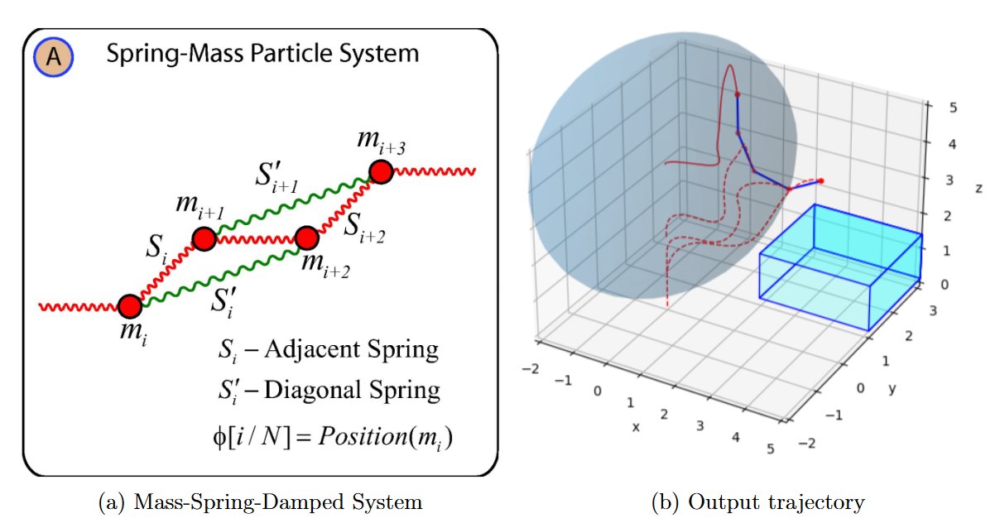
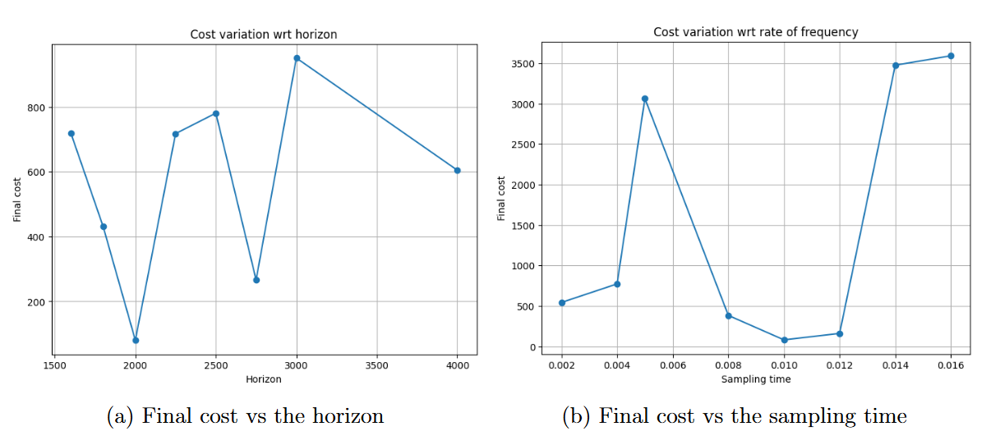

# Investigation of a Model-Based Approach for Dynamical Manipulation of Deformable Objects

This repository contains the code and experimental framework developed for the **Master’s Degree Thesis**:

**“Investigation of a Model-Based Approach for Dynamical Manipulation of Deformable Objects”**  
*October 2023*

[Link](https://webthesis.biblio.polito.it/28573/) to the full pdf.

**Candidate:** Alessia De Marco  
**Supervisors:** Prof. Massimo Canale, Prof. Ville Kyrki  
**Degree:** MSc in Mechatronics Engineering  
**Institution:** Politecnico di Torino  
**Collaboration:** Aalto University, Finland  

---

## 📌 Overview

Deformable object manipulation is a challenging problem in robotics due to the complex and highly nonlinear dynamics of non-rigid objects such as ropes, fabrics, and soft materials.  
This project investigates a **model-based trajectory optimization and optimal control approach** for the **dynamic manipulation of a deformable rope-like object**.

The selected task consists of dynamically manipulating a rope using an end-effector, bringing it from a resting configuration to an elevated box through a fast and controlled motion.

The control strategy is based on **Differential Dynamic Programming (DDP)**, specifically its efficient variant **iterative Linear Quadratic Regulator (iLQR)**, combined with **constraint handling via the Augmented Lagrangian and Method of Multipliers (ALMM)**.

---

## 🧠 Methodology

### Control and Optimization
- **Algorithm:** iLQR (iterative Linear Quadratic Regulator)
- **Framework:** Model-based optimal control
- **Cost Function:** Finite-horizon LQR-style objective
- **Constraints:** Handled using Augmented Lagrangian and Multipliers Method (ALMM)

The optimization focuses on minimizing tracking error and control effort, while enforcing task-related constraints.

---

### Deformable Object Modeling

The rope is modeled as a **Mass-Spring-Damped System (MSDS)** composed of five point masses connected by springs:

- **Structural (elastic) springs**
- **Shear springs**
- **Bend (flexion) springs**

This modeling choice offers a good trade-off between:
- Computational efficiency
- Physical realism
- Differentiability

The entire dynamics model is implemented in **Python using JAX**, enabling **automatic differentiation**, which is crucial for DDP/iLQR algorithms.



---

### Numerical Integration & Time Discretization

- **Integration method:** Runge–Kutta 4th order (RK4)
- **Dual time-step strategy:**
  - Small time-step for accurate system integration
  - Larger time-step for control updates

Control inputs are computed every *N* simulation steps and applied over the subsequent integration interval, balancing stability and computational cost.

---

## 📊 Analysis and Results

The performance of the approach is evaluated by analyzing the influence of:
- Horizon length
- Sampling time
- Cost function weights
- Penalty parameter (μ) in the Augmented Lagrangian

### Key Findings
- An **optimal horizon of 2000 steps (2 seconds)** yields the best performance for the considered task.
- Too short horizons fail to achieve the goal; too long horizons result in inefficient, slow trajectories.
- Optimal control sampling intervals are found between **8–12 simulation steps**.
- The penalty parameter μ strongly affects convergence, constraint satisfaction, and stability, requiring careful tuning.

Results show that **fast, dynamic manipulation** is essential to successfully complete the task.

---

## ⚠️ Limitations

- The MSDS model, while efficient and differentiable, has limited physical accuracy.
- Constraint satisfaction using ALMM improves initially but may stagnate after a few iterations.
- Performance is sensitive to parameter tuning (horizon, μ, sampling time).

---

## 🚀 Future Work

Potential extensions include:
- Improved deformable object models (e.g., higher-resolution MSDS or FEM-based approaches)
- Adaptive horizon selection
- Improved constraint-handling strategies
- Extension to 3D deformable object manipulation
- Real-world robotic validation

---

## 📁 Repository Structure

```text
.
├── AL_iLQR.py        # Augmented Lagrangian iLQR implementation
├── iLQR.py           # Standard iLQR / DDP implementation
├── rope_system.py    # Mass-Spring-Damped rope dynamics model
├── constraints.py    # Constraint definitions and penalty terms
├── test.py           # Main script for running simulations
├── environment.yml   # Conda environment definition
└── README.md


